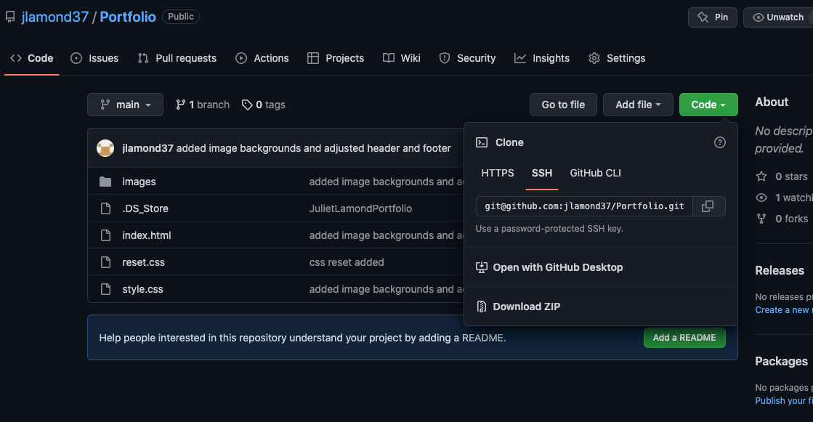

# <Code Quiz>

## Description

I built a weather dashboard that connects a city's weather with the temp, humidity, wind speed, and uv index.

## Installation

- Go to <a> https://github.com/jlamond37/Code-quiz </a>
- Click on Code
- Copy the SSH key and git clone

## Usage

-Go to GitHub and clone:

## Major Collaborators

Sean Dillon

Helped with brainstorming and variable compiling.
Github: <a> https://github.com/DeviousDoge </a>

Freddie Kwak

Helped with time formula.
Github: <a> https://github.com/fredkk22 </a>